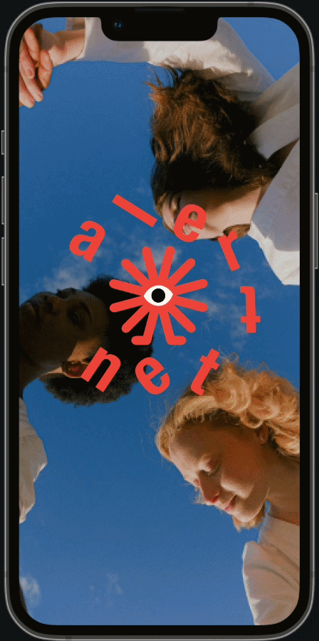
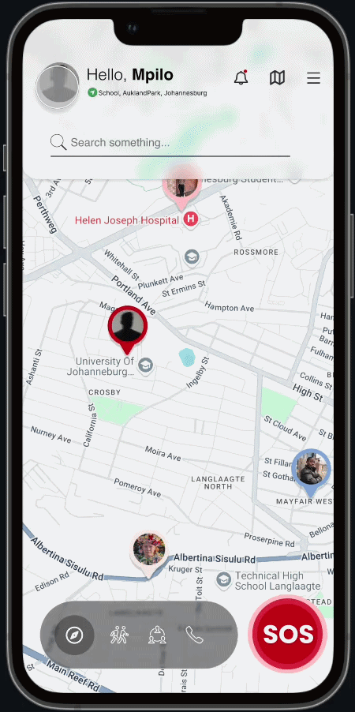
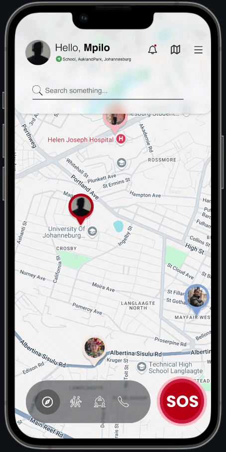
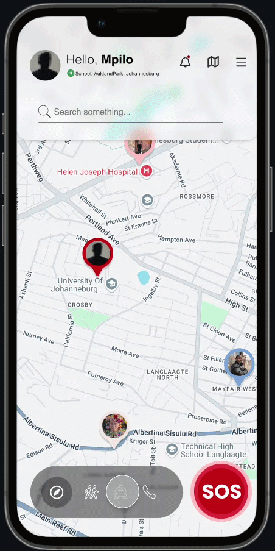
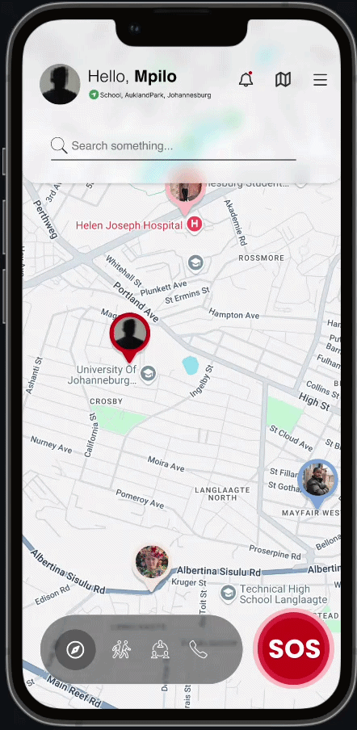

# 🛡️ AlertNet — Student Safety Mobile App

**A cross-platform mobile safety application designed to protect students in and around university campuses through real-time tracking, community-driven support, and instant emergency alerts.**

---

## 📖 Overview

**AlertNet** is a cross-platform mobile safety application developed to address the rising crime rates affecting students at urban South African universities, particularly around the University of Johannesburg (UJ) campuses in Melville, Brixton, and Auckland Park.

Traditional personal safety measures are often reactive, expensive, or inadequate for students navigating complex urban environments. AlertNet fills this gap by combining **real-time emergency alerting**, **community-driven safety networks**, and **proactive crime zone awareness** into a single, accessible, and affordable application.

Built with **React Native**, **Firebase**, **Node.js**, and **Google APIs**, AlertNet delivers reliable, fast, and scalable performance across both Android and iOS — empowering students to move safer, smarter, and together.

> 🌍 Aligned with **UN Sustainable Development Goal 11** (Safe and Inclusive Communities) and the **Fourth Industrial Revolution (4IR)** framework.

---

## ✨ Key Features

| Feature | Description |
|---|---|
| 🏠 **Home & Live Map** | Full-screen interactive map with real-time user locations, offline map download, and instant SOS access |
| 🎉 **Onboarding** | Welcoming walkthrough that introduces app features and guides new users through account creation |
| 🆘 **SOS Emergency Alert** | One-tap panic button that instantly notifies your safety circle with your live GPS location and a scannable QR code |
| 🚶 **Walk Partner System** | Connect with verified nearby users for safe, companioned journeys with live shared tracking |
| 👥 **People & Community** | Manage your safety circle, view community feeds, post local safety warnings, and message friends |
| 📞 **Emergency Helpline** | One-tap access to Police (10111), Ambulance (10177), and Campus Security with custom contact support |
| 🤖 **AI Safety Chatbot** | 24/7 AI-powered assistant using Groq API for instant safety guidance, emergency advice, and app navigation help |
| 🎙️ **Voice Activation** | Trigger SOS hands-free using a pre-configured panic passphrase |
| ⚠️ **High-Crime Zone Alerts** | Geofencing-powered notifications when entering known high-risk areas |

---

## 📱 Feature Showcase

### 🎉 Onboarding

<table border="0" cellpadding="0" cellspacing="0">
<tr>
<td width="300" valign="top"></td>
<td width="40"></td>
<td valign="top">
<h4>Welcome & Sign Up</h4>
      
AlertNet opens with a polished onboarding experience that introduces users to the app's core safety features before they sign up.

      
The welcome flow highlights key capabilities and leads directly into the registration screen, where students sign up using their:

      <ul>
        <li>📛 Full name</li>
        <li>📱 Phone number</li>
        <li>📧 Student email</li>
        <li>🔒 Secure password</li>
      </ul>
</td>
</tr>
</table>

---

### 🏠 Home Screen & Live Map

<table border="0" cellpadding="0" cellspacing="0">
<tr>
<td width="300" valign="top"></td>
<td width="40"></td>
<td valign="top">
<h4>Your Safety Dashboard</h4>
      
The Home screen is built around a <strong>full-screen interactive map</strong> displaying the user's current location and nearby points of interest.

      
A prominently placed action bar at the bottom provides instant one-thumb access to all five core navigation tabs: Locator, Walk Me, People, Helpline, and SOS.

      
Additional features include:

      <ul>
        <li>👤 <strong>User profile</strong> from the top navigation bar</li>
        <li>🔔 <strong>Notifications</strong> for real-time alerts and updates</li>
        <li>📸 <strong>Offline Map Download</strong> — save the map for use when out of data or without a connection, so you can still navigate and find directions offline</li>
      </ul>
</td>
</tr>
</table>

---

### 🆘 SOS Emergency Alert

<table border="0" cellpadding="0" cellspacing="0">
<tr>
<td width="300" valign="top"></td>
<td width="40"></td>
<td valign="top">
<h4>One Tap. Instant Help.</h4>
      
The SOS button is the core reactive safety feature of AlertNet. A single tap immediately broadcasts the user's live GPS coordinates to their entire safety circle and nearby app users.

      
The SOS screen displays a <strong>scannable QR code</strong> containing the user's emergency contact information — allowing a bystander or security guard to access critical details even if the user is incapacitated.

      
The alert deactivates when the user taps <strong>"I'm Safe Now"</strong>, sending a confirmation to all previously notified contacts.

</td>
</tr>
</table>

---

### 🚶 Walk Partner System

<table border="0" cellpadding="0" cellspacing="0">
<tr>
<td width="300" valign="top"></td>
<td width="40"></td>
<td valign="top">
<h4>Never Walk Alone</h4>
      
The Walk Partner feature connects students who need a companion for a journey with verified, nearby users willing to walk together.

      
A user initiates a request by specifying their <strong>destination</strong> and <strong>estimated duration</strong>. Once a partner accepts, a time-limited shared tracking session begins with:

      <ul>
        <li>🗺️ Live map showing both users' positions</li>
        <li>⏱️ Estimated arrival time</li>
        <li>💬 In-app messaging for coordination</li>
        <li>🛣️ Full route overview</li>
      </ul>
      
The session ends automatically upon safe arrival, preserving long-term user privacy.

</td>
</tr>
</table>

---

### 👥 People, Community & Safety Circle

<table border="0" cellpadding="0" cellspacing="0">
<tr>
<td width="300" valign="top"></td>
<td width="40"></td>
<td valign="top">
<h4>Your Safety Network</h4>
      
The People screen is AlertNet's social safety hub, combining personal contact management with community-wide safety awareness.

      <ul>
        <li>👤 <strong>My Contacts</strong> — View your safety circle with names, locations, online status, distance, and live <strong>battery percentage</strong></li>
        <li>💬 <strong>Messaging</strong> — Send direct messages to friends within the app</li>
        <li>🏘️ <strong>Community Groups</strong> — Emergency group accounts where verified organisations share critical safety updates</li>
        <li>📢 <strong>Safety Feed</strong> — Post about incidents in your area to warn other users in real time</li>
      </ul>
</td>
</tr>
</table>

---

### 📞 Emergency Helpline

<table border="0" cellpadding="0" cellspacing="0">
<tr>
<td width="300" valign="top"></td>
<td width="40"></td>
<td valign="top">
<h4>Help Is One Tap Away</h4>
      
The Helpline screen is a static, always-reliable resource for one-tap emergency calling — designed to work fast under pressure without needing to search for numbers.

      
Pre-configured quick-dial contacts include:

      <ul>
        <li>🚔 <strong>Police</strong> — 10111</li>
        <li>🚑 <strong>Ambulance</strong> — 10177</li>
        <li>🏫 <strong>Campus Security</strong> — 011 559 2555</li>
      </ul>
      
Users can also tap <strong>+ Add</strong> to store additional numbers such as family members or personal medical contacts.

</td>
</tr>
</table>

---

### 🤖 AI Safety Chatbot

> **Note:** A screen recording for this feature is not yet available.

AlertNet includes an AI-powered chatbot built using the **Groq API**, giving students instant access to safety guidance and support at any time. The chatbot assists users with:

- 🛡️ **Safety tips** — real-time advice on staying safe in high-risk areas
- 📍 **App navigation help** — guiding users through features like Walk Partner and SOS
- 🚨 **Emergency guidance** — step-by-step advice for different emergency situations
- 💬 **General queries** — fast, conversational responses powered by Groq's ultra-low-latency AI inference engine, delivering answers in milliseconds even under high-stress conditions

---

## 🛠️ Tech Stack

### Frontend

| Technology | Purpose |
|---|---|
| **React Native** | Cross-platform UI framework (single codebase for iOS & Android) |
| **JavaScript** | Core application logic |
| **Expo** | Device API access (biometrics, location, notifications) |
| **Kotlin / Swift** | Native extensions for background geofencing and voice recognition |

### Backend

| Technology | Purpose |
|---|---|
| **Node.js** | Primary backend — asynchronous, non-blocking real-time data handling |
| **Firebase Authentication** | Secure user registration, login, and session management |
| **Firebase Realtime Database** | Live GPS sync, alert status updates, and safety circle data |
| **SQL (Relational Layer)** | Structured data — audit logs, historical records, reporting |

### APIs & Services

| Service | Purpose |
|---|---|
| **Google Maps API** | Interactive maps and location visualisation |
| **Google Geofencing API** | High-crime zone boundary detection |
| **Google Geocoding & Directions API** | Address lookup and safe route suggestions |
| **Firebase Cloud Messaging (FCM)** | Reliable push notifications to emergency contacts |
| **YouTube API** | Linked safety resource videos (keeps app lightweight) |
| **Resend** | Automated email notifications to emergency contacts |
| **Groq API** | Ultra-fast AI inference engine powering the in-app safety chatbot |

---

## 🧪 Testing & Performance

### Testing Methodology

AlertNet was validated through a three-phase testing process:

- **Unit Testing** — Individual module verification including SOS activation, Walk Partner request flow, and contact synchronisation
- **Integration Testing** — Verified seamless communication between the app, Firebase, and Google APIs (geofencing and location tracking)
- **User Acceptance Testing (UAT)** — Conducted with university students in simulated emergency scenarios to assess real-world performance and usability

### Performance Metrics

| Metric | Result |
|---|---|
| ⚡ Average SOS alert response time | **2.7 seconds** |
| 📍 Location tracking accuracy | **99%** |
| 🔔 Notification delivery success rate | **98%** |
| 🟢 System uptime target | **> 99%** |

### Key Test Results

| Test Case | Status |
|---|---|
| SOS Activation → Alert delivered to all contacts with live location | ✅ Passed |
| Walk Partner Request → Connection established successfully | ✅ Passed |
| Emergency Notification → Correct location delivered to contact | ✅ Passed |
| High-Crime Zone Alert → Notification triggered with route suggestion | ✅ Passed |
| Voice Activation → SOS triggered in quiet environment | ⚠️ Minor issues in noisy environments |

### Bug Fixes During Development

- **Delayed Notifications** → Resolved by integrating Firebase Cloud Messaging for faster push delivery
- **Location Lag** → Improved GPS accuracy through background caching optimisation
- **Voice Feature False Negatives** → Adjusted recognition sensitivity thresholds

---

## 👨‍💻 My Contribution

As a core member of the AlertNet development team, I was responsible for the following areas:

### 🎨 UI/UX Design
Designed intuitive, stress-responsive interfaces across the app with a focus on minimising cognitive load during emergencies. Ensured visual consistency, accessibility, and ease of use across all screens.

### 🖥️ Frontend — People & Community Screen (Full Ownership)
I was solely responsible for building the entire **People Bar** screen from the ground up, including every feature within it:

- 👤 **Add User** — built the flow for searching and sending friend requests to other users
- ✅ **Accept Friends** — implemented the friend request acceptance system and contact list management
- 🔔 **In-App Notifications** — developed the real-time notification system to alert users of friend requests, safety updates, and community activity
- 🔋 **Friends Battery Percentage** — integrated live device battery capture and display so users can see if their contacts are reachable
- 💬 **Chat Box** — built the in-app direct messaging feature allowing users to communicate with their safety circle
- 📢 **Community Feed & Groups** — developed the safety feed where users can post local incident warnings, and the community group accounts for verified safety organisations
- ➕ **Additional People Bar features** — handled all remaining functionality within the screen end to end

### 🤖 Frontend — AI Chatbot Integration
Integrated the **Groq API** into the app to power the AlertNet AI safety chatbot, enabling fast, low-latency conversational responses for safety guidance, emergency advice, and app support.

### ⚙️ Backend
Contributed to backend development including server-side logic, data handling, and API integrations to support the features built on the frontend.

---

## 🤝 Team Experience

AlertNet was developed using an **Agile (Scrum)** methodology across a cross-functional team of 7 members from the Information Systems programme, working in close collaboration with a Marketing (MM) student team.

- 🔄 **Iterative Development** — Working in structured sprints allowed us to incorporate user feedback continuously and refine features before finalisation
- 🤝 **Cross-Functional Collaboration** — Regular communication between the technical (AIS) and marketing (MM) teams ensured the product was both technically sound and user-centered
- 🧩 **Problem-Solving Under Constraints** — With limited testing resources during an active academic term, we adapted by conducting simulated user journeys and recording usability data
- 🌍 **Real-World Impact Mindset** — Every decision was grounded in solving a genuine safety problem affecting real students in our community

---

## 🔮 Future Improvements

| Improvement | Description |
|---|---|
| 📵 **Offline SOS (SMS Fallback)** | SMS-based alert delivery for areas with no internet connectivity |
| 🚔 **Authority Integration** | Partner with SAPS and campus security for real-time response and verified data sharing |
| 🎙️ **Voice Feature Enhancement** | Improve passphrase recognition accuracy in high-noise environments |
| 🔋 **Battery Optimisation** | Implement adaptive GPS refresh rates to reduce power consumption |
| 🌐 **Multilingual Support** | Add isiZulu, Afrikaans, and Sesotho for broader accessibility |
| ♿ **Accessibility Features** | Voice feedback and screen reader support for visually impaired users |
| 🏫 **Campus Pilot Deployment** | Structured pilot testing within UJ campuses before public release |

---

## 🎯 Conclusion

AlertNet demonstrates that mobile technology, when thoughtfully designed, can serve as a powerful equaliser for community safety. By combining proactive alerts, community-driven features, and reactive emergency tools into a single, affordable, and accessible application, AlertNet addresses a genuine and urgent need for South African students navigating high-risk urban environments.

The project proved that real-world problems can be tackled with well-chosen technology, collaborative teamwork, and a user-first design philosophy. With further development — particularly offline capability, authority integration, and broader deployment — AlertNet has strong potential to become a meaningful safety infrastructure tool across South Africa and beyond.

---

## 👥 Team

| Name | Student Number |
|---|---|
| Mpilonle Radebe | 222087503 |
| Kevin Serakalala | 223088123 |
| Thembinkosi Madiba | 222223279 |
| Siphephile Mtshali | 223125261 |
| Okuhle Mgudlwa | 222073209 |
| Musa Buthelezi | 222023907 |
| Nathi Gumede | 222021634 |

**Supervisor:** Thamie Mhlanga  
**Module:** Information System 3B — 250PRO001  
**Institution:** University of Johannesburg

---

## 📄 License

This project was developed as an academic submission. All rights reserved by the AlertNet development team © 2025.

---

**Built with ❤️ to make campuses safer — one alert at a time.**

